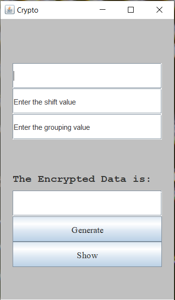
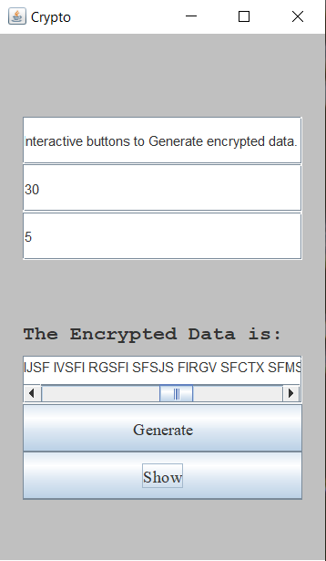

# **Crypto_2020:** _Caesar Cipher Encryption_

A GUI based Java program that encrypts data according to the user's preference of encryption. 
Interactive buttons to Generate encrypted data.

### Working:

* Enter the Data to be encrypted in 1st row.
* Enter a Numeric in second row, to set the level of encryption.
* Enter a Numeric to set the length of groups the data needs to be broken in.

* Press Generate followed by Show.
* Encrypted data pops up in the last Output Section.

### Future

* Integrating more complicated Encryption algoritm for more levels of security.
